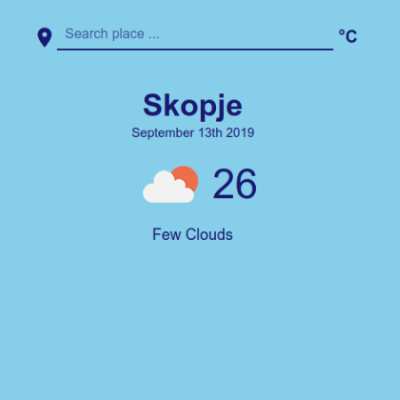

# Weather App



## Summary

This is a weather web application in JavaScript. It shows the current weather for the current location.  
You can change the location by searching it in the top bar. The temperature can be converted to Celsius or Fahrenheit.

You can check out the [live demo](https://jeton-th.github.io/weather-app/).

## Getting Started

Follow these instructions to get a copy of the project up and running on your
local machine for development and testing purposes.

### Prerequisites  

This project runs with Node.js and NPM. If you don't have those installed, follow this
[guide](https://docs.npmjs.com/downloading-and-installing-node-js-and-npm).  
Then if you haven't already, clone the [repository](https://github.com/jeton-th/weather-app).

### Installing  

Install all project dependencies:
```
npm install
```

### Serve Project

Start the application with the following command:
```
npm start
```
The page will automatically open in the browser.

## Contributors
* [Jeton Thaçi](https://github.com/jeton-th)

## Credits:
* [Open Weather](https://openweathermap.org/api) - for weather data
* [Google Developers API](https://console.developers.google.com/apis) - for places autocomplete search


